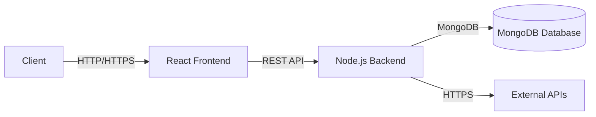
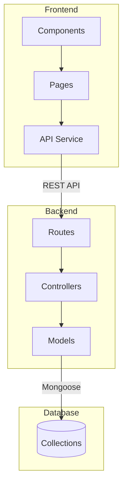
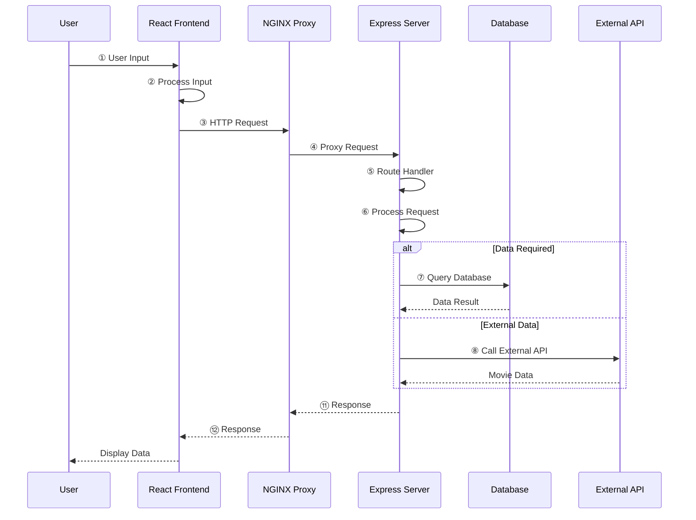
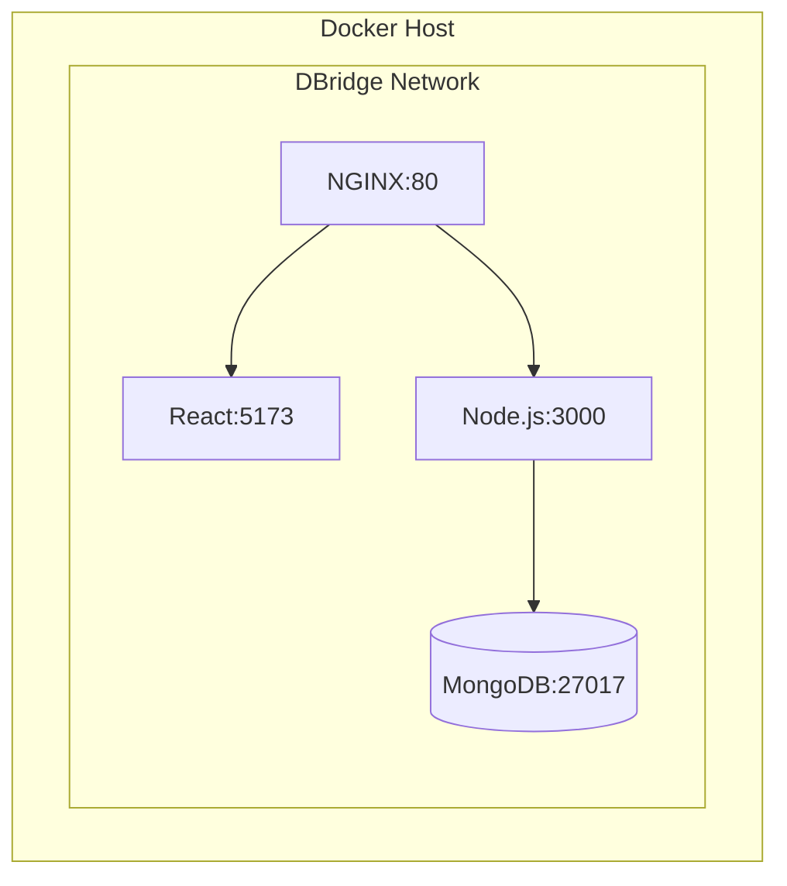
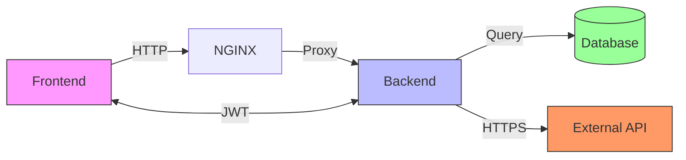

# Movie Explorer

A full-stack movie exploration application built with React, Node.js, and Express. This application allows users to browse, search, and explore information about movies.

## Features

- Browse popular and trending movies
- Search for movies by title
- View detailed movie information
- Responsive design for all devices
- Secure authentication system
- Rate limiting for API protection

## Prerequisites

Before you begin, ensure you have the following installed:

- [Docker](https://docs.docker.com/get-docker/)
- [Docker Compose](https://docs.docker.com/compose/install/)

## Getting Started

### 1. Clone the Repository

```bash
git clone https://github.com/yourusername/movie-explorer.git
cd movie-explorer
```

### 2. Create an Environment File

Create a `.env` file in the root of the project and add the following environment variables. 

```
# Server Configuration
PORT=5000
MONGO_URI=mongodb://mongodb:27017/movie-explorer
JWT_SECRET=your_jwt_secret_key
TMDB_API_KEY=your_tmdb_api_key

# MongoDB Credentials
MONGO_INITDB_ROOT_USERNAME=your_mongo_admin_user
MONGO_INITDB_ROOT_PASSWORD=your_mongo_admin_password

# Mongo Express Configuration
ME_CONFIG_MONGODB_ADMINUSERNAME=your_mongo_admin_user
ME_CONFIG_MONGODB_ADMINPASSWORD=your_mongo_admin_password
ME_CONFIG_BASICAUTH_USERNAME=your_mongo_express_user
ME_CONFIG_BASICAUTH_PASSWORD=your_mongo_express_password
```

### 3. Build and Run the Application

```bash
docker-compose up --build
```

Once the containers are up and running, you can access the application at:

- **Frontend:** [http://localhost:80](http://localhost:80)
- **Backend:** [http://localhost:5000](http://localhost:5000)
- **Mongo Express:** [http://localhost:8081](http://localhost:8081)

## Environment Variables

| Variable                          | Description                                      |
| --------------------------------- | ------------------------------------------------ |
| `PORT`                            | The port for the backend server.                 |
| `MONGO_URI`                       | The connection string for the MongoDB database.  |
| `JWT_SECRET`                      | A secret key for signing JWT tokens.             |
| `TMDB_API_KEY`                    | Your API key for The Movie Database (TMDb).      |
| `MONGO_INITDB_ROOT_USERNAME`      | The root username for the MongoDB instance.      |
| `MONGO_INITDB_ROOT_PASSWORD`      | The root password for the MongoDB instance.      |
| `ME_CONFIG_MONGODB_ADMINUSERNAME` | The admin username for Mongo Express.            |
| `ME_CONFIG_MONGODB_ADMINPASSWORD` | The admin password for Mongo Express.            |
| `ME_CONFIG_BASICAUTH_USERNAME`    | The username for accessing Mongo Express.        |
| `ME_CONFIG_BASICAUTH_PASSWORD`    | The password for accessing Mongo Express.        |

## Project Structure

```
movie-explorer/
├── client/                 # Frontend React application
│   ├── public/            # Static files
│   └── src/               # React source code
│       ├── components/    # Reusable UI components
│       ├── pages/         # Page components
│       └── ...
└── server/                # Backend Node.js/Express server
    ├── src/
    │   ├── config/       # Configuration files
    │   ├── controllers/  # Route controllers
    │   ├── middleware/   # Custom middleware
    │   └── index.js      # Server entry point
    └── .env              # Environment variables
```

## Available Scripts

While Docker is the recommended way to run the project, you can also run the client and server independently.

### Client

- `npm run dev`: Start the development server.
- `npm run build`: Build the application for production.
- `npm run preview`: Preview the production build.
- `npm run lint`: Run the linter.

### Server

- `npm start`: Start the production server.
- `npm run dev`: Start the development server with Nodemon.

## System Architecture

### High-Level Overview



### Detailed Component Architecture



### Data Flow



### Deployment Architecture



### Component Relationships



