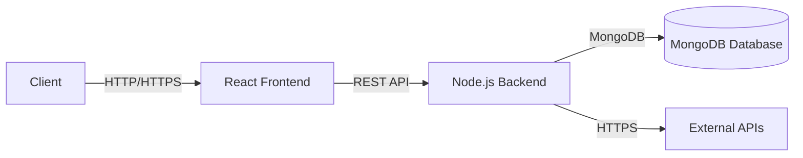
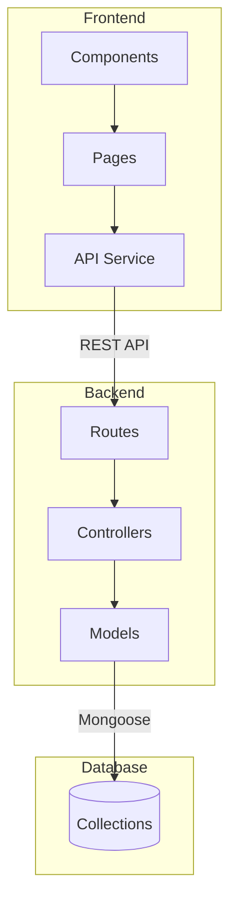
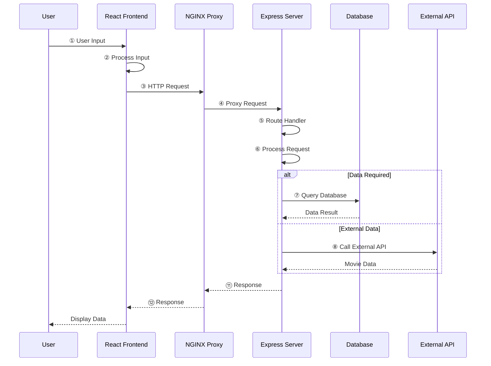
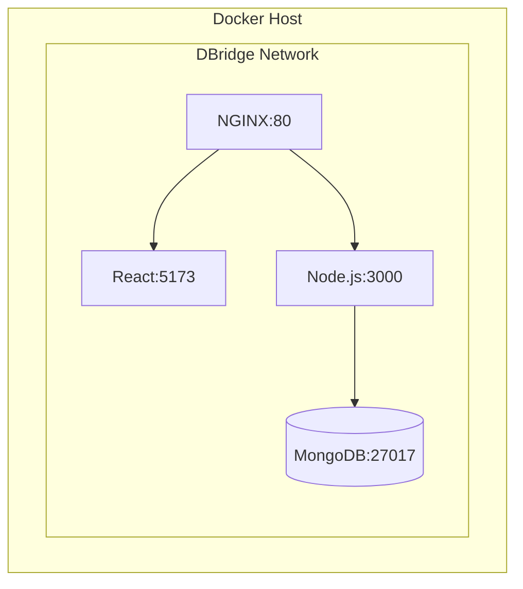
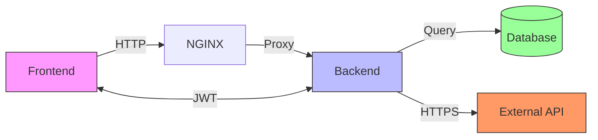

# Movie Explorer

A full-stack movie exploration application built with React, Node.js, and Express. This application allows users to browse, search, and explore information about movies.

## Features

- Browse popular and trending movies
- Search for movies by title
- View detailed movie information
- Responsive design for all devices
- Secure authentication system
- Rate limiting for API protection

## Prerequisites

- Node.js (v16 or higher)
- npm (v8 or higher)
- MongoDB (for database)

## Getting Started

### 1. Clone the repository

 
git clone https://github.com/yourusername/movie-explorer.git
cd movie-explorer

### 2. Set up the Backend

1. Navigate to the server directory:
    
   cd server

2. Install dependencies:
    
   npm install

3. Create a `.env` file in the server directory with the following variables:
   PORT=5000
   MONGODB_URI=your_mongodb_connection_string
   JWT_SECRET=your_jwt_secret_key
   TMDB_API_KEY=your_tmdb_api_key
   NODE_ENV=development

4. Start the development server:
    
   npm run dev
   The server will be running at `http://localhost:5000`

### 3. Set up the Frontend

1. Open a new terminal and navigate to the client directory:
    
   cd ../client

2. Install dependencies:
    
   npm install

3. Start the development server:
    
   npm run dev
   The React app will be running at `http://localhost:5173`

## Project Structure

movie-explorer/
├── client/                 # Frontend React application
│   ├── public/            # Static files
│   └── src/               # React source code
│       ├── components/    # Reusable UI components
│       ├── pages/         # Page components
│       └── ...
└── server/                # Backend Node.js/Express server
    ├── src/
    │   ├── config/       # Configuration files
    │   ├── controllers/  # Route controllers
    │   ├── middleware/   # Custom middleware
    │   └── index.js      # Server entry point
    └── .env              # Environment variables

## Available Scripts

### Client
- `npm run dev` - Start development server
- `npm run build` - Build for production
- `npm run preview` - Preview production build
- `npm run lint` - Run ESLint

### Server
- `npm start` - Start production server
- `npm run dev` - Start development server with nodemon

## System Architecture

### High-Level Overview

### Detailed Component Architecture

### Data Flow

### Deployment Architecture

### Component Relationships

## Environment Variables

## Environment Variables

### Server (.env)
- `PORT` - Port to run the server on (default: 5000)
- `MONGODB_URI` - MongoDB connection string
- `JWT_SECRET` - Secret key for JWT authentication
- `TMDB_API_KEY` - API key for The Movie Database (TMDb)
- `NODE_ENV` - Application environment (development/production)

